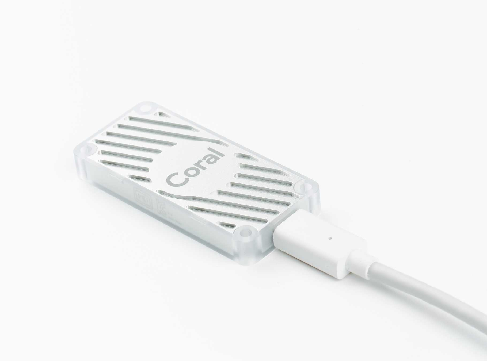
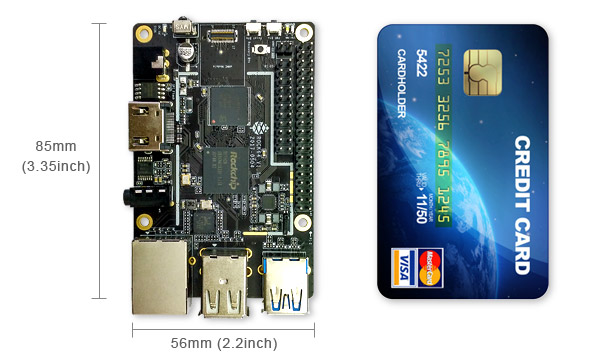

# Estimation of Google Edge TPU Accelerator



Estimates Edge TPU performace on some linux system such as RaspberryPi, [Rock64@Pine64](https://www.pine64.org/?product=rock64-media-board-computer) etc.  

As of now, Raspbian OS bases on Ubuntu Xenial(16.04 LTS) build as 32bit OS.  

Rock64@Pine64 has compatible form factor of RaspberryPi 3 Model B(+), but Rock64@Pine64 supports many variant Destribution of Linux such as Ambian, Ubuntu, Debian etc. android too, and supports 32bit and 64bit OS.    

RaspberryPi-3 has 4 USB-2.0 ports.  
Rock64@Pine64 has 2 USB-2.0 ports and 1 USB-3.0 port.  
Edge TPU expects using via USB-3.0 and on 64bit aarch64 OS, therefore Rock64@Pine64 is suitable for Edge TPU.  

## Getting start of Google Edge TPU Accelerator Coral.  
According to [Getting start](https://coral.withgoogle.com/docs/accelerator/get-started/),  

*Requirements  
Any Linux computer with a USB port  
  Debian 6.0 or higher, or any derivative thereof (such as Ubuntu 10.0+)  
  System architecture of either x86_64 or ARM64 with ARMv8 instruction set  
And yes, this means Raspberry Pi is supported. However,
it must be Raspberry Pi 2/3 Model B/B+ running Raspbian (or another Debian derivative).*  

It's a very easy to install Edge TPU on Debian linux system but Windows OS is not supported.  
Notice!: Needs Internet access from host system.  

```
# apt update
$ cd ~/
$ wget https://dl.google.com/coral/edgetpu_api/edgetpu_api_latest.tar.gz -O edgetpu_api.tar.gz --trust-server-names --no-check-certificate
$ tar xzf edgetpu_api.tar.gz
$ cd edgetpu_api
$ bash ./install.sh
```

Investigating *install.sh* script we can found out that script supports bellow CPU architectures,  

- armv7l  
  When uname -m returns *armv7l* and system file /proc/device-tree/model denotes any words such as *RaspberryPi-3*, 32bit library is installed on somewhere of /usr/lib...  

- x86_64 or aarch64  
  When uname -m returns *x86_64* or *aarch64* 64bit library is installed on somewhere of /usr/lib...  
  But if system was 32bit OS on 64bit Hardware then 64bit library will be installed and may be system fall into crash!  

## Python API  
According to [Python API](https://coral.withgoogle.com/docs/edgetpu/api-intro/) two key api are provided as  *ClassificationEngine* and *DetectionEngine*.   

## Edge TPU Accelerator on RaspberryPi-3 Model B+  

- Install OS image and boot  
  Download and flash SDCard bellow,  
  2018-10-09-raspbian-stretch.img  
  
- Update system  
  $ apt update  
  $ apt upgrade  
  
- Check python3 --version  
  Python 3.5.3  
  
- Install edgetpu_api according to [geting start](https://coral.withgoogle.com/docs/accelerator/get-started/)  
- Run *ClassificationEngine* demo with parrot.jpg  
  ```
  $ cd ~/Downloads/
  $ wget https://storage.googleapis.com/cloud-iot-edge-pretrained-models/canned_models/mobilenet_v2_1.0_224_inat_bird_quant_edgetpu.tflite \
    http://storage.googleapis.com/cloud-iot-edge-pretrained-models/canned_models/inat_bird_labels.txt \
    https://coral.withgoogle.com/static/images/parrot.jpg  --no-check-certificate
    
  $ cd /usr/local/lib/python3.5/dist-packages/edgetpu/demo
  $ python3 classify_image.py \
    --model ~/Downloads/mobilenet_v2_1.0_224_inat_bird_quant_edgetpu.tflite \
    --label ~/Downloads/inat_bird_labels.txt \
    --image ~/Downloads/parrot.jpg
    
     W0208 14:27:30.933504    1573 package_registry.cc:65] Minimum runtime
     version required by package (5) is lower than expected(10).
     ---------------------------
     Ara macao (Scarlet Macaw)
     Score :  0.761719 
  ```
This demo model can recognize 964 kinds of birds.  
...  
960 Anser anser domesticus (Domestic Goose)  
961 Mitrephanes phaeocercus (Tufted Flycatcher)  
962 Ardenna creatopus (Pink-footed Shearwater)  
963 Ardenna gravis (Great Shearwater)  
...  
*Ara macao* means KONGO-INKO in japanese. It's a kind of parrot(bird).  


- Run *DetectionEngine* demo with face.jpg  

```
  $ cd ~/Downloads
  $ wget https://storage.googleapis.com/cloud-iot-edge-pretrained-models/canned_models/mobilenet_ssd_v2_face_quant_postprocess_edgetpu.tflite https://coral.withgoogle.com/static/images/face.jpg  --no-check-certificate
  # apt install feh
  $ cd /usr/local/lib/python3.5/dist-packages/edgetpu/demo
  $ python3 object_detection.py \
    --model ~/Downloads/mobilenet_ssd_v2_face_quant_postprocess_edgetpu.tflite \
    --input ~/Downloads/face.jpg --output ~/Downloads/detection_results.jpg
    W0208 15:14:29.736634    2141 package_registry.cc:65] Minimum runtime version required by package (5)
    is lower than expected (10).
-----------------------------------------
score =  0.996094
box =  [474.22854804992676, 38.03488787482766, 738.8013491630554, 353.5309683683231]
-----------------------------------------
score =  0.992188
box =  [205.4297697544098, 110.28378465056959, 487.75309658050537, 439.73802454331343]
-----------------------------------------
score =  0.832031
box =  [6.2277887016534805, 182.35811898071842, 127.13575917482376, 326.5376813379348]
-----------------------------------------
score =  0.5
box =  [859.8422718048096, 213.5472493581642, 1008.978108882904, 383.9367261515483]

```
feh : feh/stable,now 2.18-2 armhf imlib2 based image viewer  
detection_result is,  
  

#### Demo via csi-camera  

- [Setup MIPI-CSI Camera on RaspberryPI-3](https://github.com/k5iogura/ncsdk_v2/blob/master/RaspberryPi_CSI.md)  

- Test COCO Object Detection Demo script like bellow,  
```
  $ cd RaspberryPi
  $ python3 demo_csi_ssd_mobilenet.py
```

- [How to start Demo at immediately after starting X-Window session](https://github.com/k5iogura/ncsdk_v2/blob/master/Raspbian_StartDemo.md)  


## Edge TPU Accelerator on Rock64@Pine64  

### [Demo for Rock64](README_Rock64.md)  

  

- [Software download](http://wiki.pine64.org/index.php/ROCK64_Software_Release)  
There are latest OS images supported by Rock64.  

- [Software github](https://github.com/ayufan-rock64/linux-build/releases)  
There are archives of OS historical images.  

Rock64@Pine64 is ARM 64bit Hardware therefore with 64bit Debian Linux OS should be selected.  

We tried some OS bellows,  
- Armbian_5.75_Rock64_Debian_stretch_default_4.4.174_desktop  
  Debian 9 stretch 64bit build with desktop environment.  
  Default root/pass = root/1234
  
- stretch-minimal-rock64-0.7.8-1061-arm64  
  Debian 9 stretch minimal build without desktop environment.  
  Default root/pass = rock64/rock64
  
- bionic-lxde-rock64-0.8.0rc9-1120-arm64.img  
  Ubuntu 18.06 64bit build with desktop environment.  
  Default root/pass = rock64/rock64
  
#### Summary of installation of Edge TPU Accelerator

|OS                |File                                   |Python|edgetpu_api|Edge TPU Status               |
|-                 |-                                      |-     |-          |-                             |
|bionic 18.04.2 LTS|bionic-lxde-rock64-0.8.0rc9-1120-arm64 |3.6.12|19.2-py3   |cannot open shared object file|
|Debian 9(stretch) |stretch-minimal-rock64-0.7.8-1061-arm64|3.5.3 |19.2-py3   |Work file :smile:             |
|Debian 9(stretch) |Armbian_5.75_Rock64_Debian_stretch_default_4.4.174_desktop|3.5.3 |19.2-py3   |Work file :smile:             |

#### Using stretch-minimal-rock64-0.7.8-1061-arm64  

OS image *stretch-minimal* bases on Debian 9 stretch without desktop environment.  

To enable dhcp, jp106 keyboard etc.  
- edit /etc/network/intefaces for DHCP if need.  
 ```
  auto eth0
  allow-hotplug eth0
  iface eth0 inet dhcp
 ```
- Edit /etc/default/keyboard for jp.  
 ```
  XKBMODEL="jp106"
  XKBLAYOUT="jp"
 ```

- How to check OS bit,  
 ```
  $ file /bin/ls
  /bin/ls: ELF 64-bit LSB executable, x86-64, version 1 (SYSV), dynamically linked, interpreter /lib64/l,
  for GNU/Linux 2.6.32, BuildID[sha1]=d0bc0fb9b3f60f72bbad3c5a1d24c9e2a1fde775, stripped
     or 
  $ objdump -p /bin/ls
  /bin/ls:     file format elf64-x86-64
 ```

- Modify Destribution Environment  
   - Official support OS is Debian 6 or later but not work on Ubuntu bionic.
     I gess that Edge TPU Accelerator needs Python 3.5.xx version reason why provided *_edge_cpp_wrapper.so* only is 35m.  
     Look at installed edgetpu library /usr/local/lib/python3.5/dist-packages/edgetpu/swig directory,  
 ```
-rw-r--r--  1 root staff 2232960 Jul 21 21:36 _edgetpu_cpp_wrapper.cpython-35m-aarch64-linux-gnu.so
-rw-r--r--  1 root staff 2089516 Jul 21 21:36 _edgetpu_cpp_wrapper.cpython-35m-arm-linux-gnueabihf.so
-rw-r--r--  1 root staff 1967728 Jul 21 21:36 _edgetpu_cpp_wrapper.cpython-35m-x86_64-linux-gnu.so
-rw-r--r--  1 root staff 1992232 Jul 21 21:36 _edgetpu_cpp_wrapper.cpython-36m-x86_64-linux-gnu.so
-rw-r--r--  1 root staff   16554 Jul 21 21:36 edgetpu_cpp_wrapper.py
```
It seems only Python3.5 or 3.6 are supported and on aarch64 supports 3.5 only now.  
  
   - lsb_release information  
 ```
$ cat /etc/*release*
PRETTY_NAME="Debian GNU/Linux 9 (stretch)"
NAME="Debian GNU/Linux"
VERSION_ID="9"
VERSION="9 (stretch)"
ID=debian
HOME_URL="https://www.debian.org/"
SUPPORT_URL="https://www.debian.org/support"
BUG_REPORT_URL="https://bugs.debian.org/"
 ```
   - To avoid SSL:Error of pip or pip3  
edit ~/.pip/pip.conf like bellow,  
```
[global]
trusted-host = pypi.python.org
               pypi.org
               files.pythonhosted.org
```

- Install edgetpu_api according to [geting start](https://coral.withgoogle.com/docs/accelerator/get-started/)  

- Run *ClassificationEngine* demo with parrot.jpg  

```
 $ cd ~/Downloads/
 $ wget https://storage.googleapis.com/cloud-iot-edge-pretrained-models/canned_models/mobilenet_v2_1.0_224_inat_bird_quant_edgetpu.tflite \
    http://storage.googleapis.com/cloud-iot-edge-pretrained-models/canned_models/inat_bird_labels.txt \
    https://coral.withgoogle.com/static/images/parrot.jpg  --no-check-certificate
 $ cd /usr/local/lib/python3.5/dist-packages/edgetpu/demo
 $ python3 classify_image.py --model ~/Downloads/mobilenet_v2_1.0_224_inat_bird_quant_edgetpu.tflite \
--label ~/Downloads/inat_bird_labels.txt --image ~/Downloads/parrot.jpg
W0721 22:20:01.232883    3945 package_registry.cc:65] Minimum runtime version required by package (5)
is lower than expected (10).
---------------------------
Ara macao (Scarlet Macaw)
Score :  0.761719
```

- Run *DetectionEngine* demo with face.jpg  

```
$ cd ~/Downloads
$ wget https://storage.googleapis.com/cloud-iot-edge-pretrained-models/canned_models/mobilenet_ssd_v2_face_quant_postprocess_edgetpu.tflite https://coral.withgoogle.com/static/images/face.jpg  --no-check-certificate
# apt install feh
$ python3 object_detection.py \
    --model ~/Downloads/mobilenet_ssd_v2_face_quant_postprocess_edgetpu.tflite \
    --input ~/Downloads/face.jpg --output ~/Downloads/detection_results.jpg
W0721 22:26:39.865575    4098 package_registry.cc:65] Minimum runtime version required by package (5) is lower than expected (10).
-----------------------------------------
score =  0.996094
box =  [474.22854804992676, 38.03488787482766, 738.8013491630554, 353.5309683683231]
-----------------------------------------
score =  0.992188
box =  [205.4297697544098, 110.28378465056959, 487.75309658050537, 439.73802454331343]
-----------------------------------------
score =  0.832031
box =  [6.2277887016534805, 182.35811898071842, 127.13575917482376, 326.5376813379348]
-----------------------------------------
score =  0.5
box =  [859.8422718048096, 213.5472493581642, 1008.978108882904, 383.9367261515483]
Please check  /home/rock64/Downloads/detection_results.jpg
$ ls detection_result.jpg
  detection_results.jpg
```

- Install *eog* command.  

```
    # apt install eog \
    xsever-xorg-video-all \
    x11-xserver-utils \
    xinit \
    xterm\
    twm \
    fonts-vlgothic \
    x11-apps
    $ eog detection_result.jpg
```

  
Good:smile:

I need to install OpenCV from source code because opencv-python package is not supported for python3 on stretch-minimal, can not use USB Camera via /dev/video0. Refer to [Demo for Rock64](README_Rock64.md)  

#### [Using Armbian_5.75_Rock64_Debian_stretch_default_4.4.174_desktop](README_Rock64.md)  

For Camera Demo i use Armbian stretch because it bases on Debian 9, has python3.5.3 with Desktop environment.  

## Performance Report  

Comparison of Edge TPU via USB-2.0 with RaspberryPi ModelB+ versus via USB-3.0 with Rock64.  

|SBC                |OS                    |TPU via USB|CameraIF|FPS |
|-                  |-                     |:-         |-       |:-  |
|RaspberryPi ModelB+|32bit Raspbian Stretch|2.0        |CSI     |10  |
|Rock64             |64bit Armbian Stretch |3.0        |USB     |22  |
