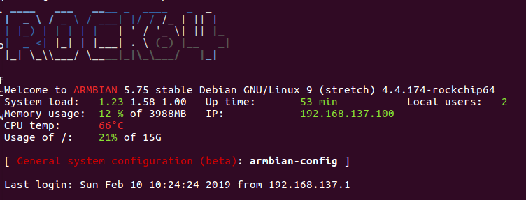

# Neural Network DEMO with Rock64@Pine64 compatible RaspberryPi with USB3.0

  

## Installation of Requirement packages

### OpenCV with Python3.5  
Needs installation from source code.  

- First of all,  
apt install bellow,  
python3-pip python-pip  
pip3 install setuptools  

To avoid pip SSL certificate error, edit ~/.pip/pip.conf like bellow,
[global]
trusted-host = pypi.python.org
               pypi.org
               files.pythonhosted.org

- requirements apt  
build-essential cmake unzip pkg-config  
libjpeg-dev libpng-dev libtiff-dev  
libavcodec-dev libavformat-dev libswscale-dev libv4l-dev  
libxvidcore-dev libx264-dev  
libgtk-3-dev  
libatlas-base-dev gfortran  
python3-dev  

- build from source  
    $ wget -O opencv.zip https://github.com/opencv/opencv/archive/3.4.3.zip --no-check-certificate  
    $ wget -O opencv_contrib.zip https://github.com/opencv/opencv_contrib/archive/3.4.3.zip --no-check-certificate  
    
    $ unzip opencv.zip  
    $ unzip opencv_contrib.zip  
    
    $ pip3 install numpy
